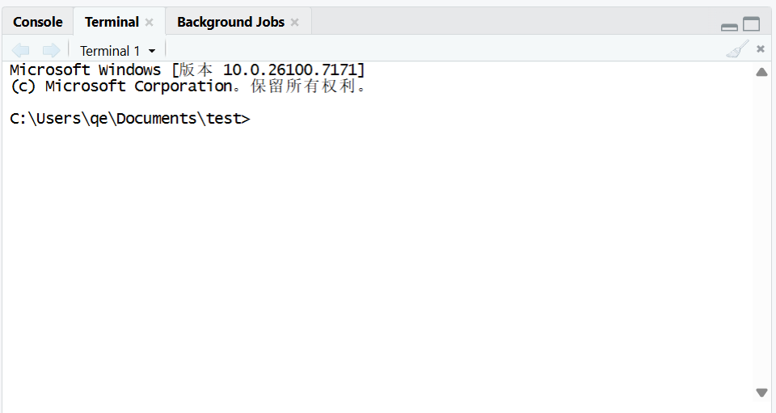
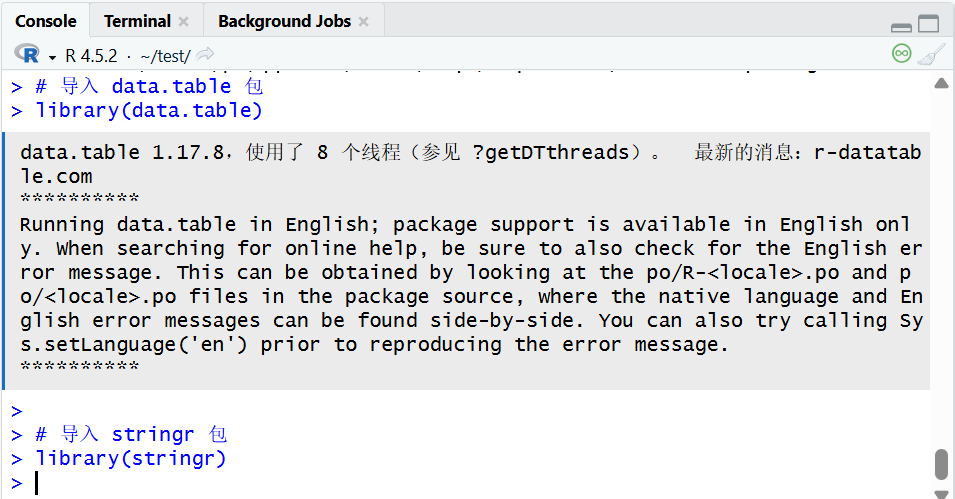
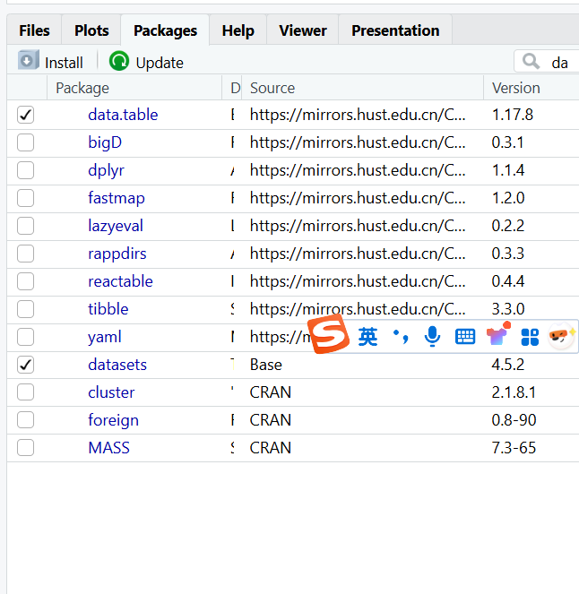
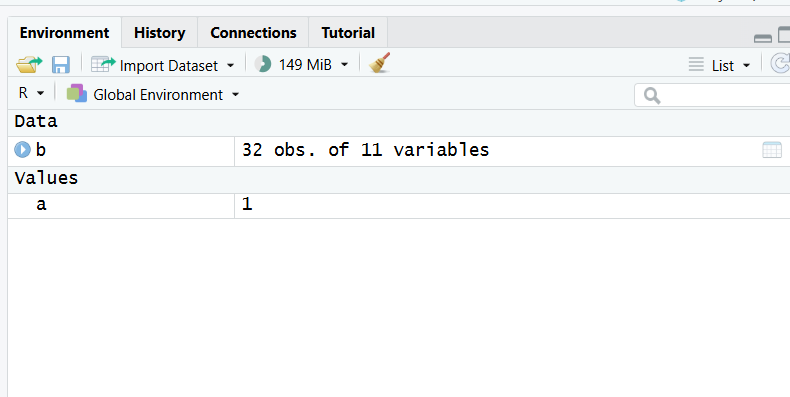

1.快捷键（首选）：Ctrl+Enter 按钮点击：点击代码编辑器顶部的「Run」按钮

2.控制台

终端

3.核心函数：`install.packages()`

4.导入包的核心函数：`library()`（最常用）和 `require()`

5.安装仅需 1 次，导入每次重启都要做

6.赋值符号\<-（左箭头，最常用，R 语言社区主流规范）,快捷键alt+-

7.

8.单行注释：用 #，快捷键 Ctrl+/； 多行注释：优先用 “选中多行 + 快捷键” 批量加 #，长文本说明可用 '''/""" 包裹；
